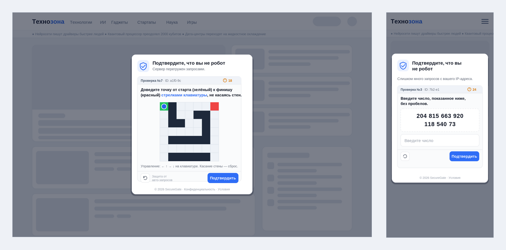

# Endless Verify — «бесконечная капча»

Сначала загружается скелетон новостного техно-портала, затем страница
«блюрится», и поверх неё выпадает окно «Сервер перегружен запросами,
подтвердите, что вы не робот». Дальше пользователя гоняют по **бесконечной
череде капч** — и все они **всегда проваливаются**: даже если успеть и
нажать «Подтвердить», тут же грузится следующая, а счётчик растёт без конца.

Чистые **HTML + CSS + JS**, без сборки и зависимостей. Разворачивается как
обычная статика (GitHub Pages, Netlify, nginx, S3). Вдохновлено код-джемом
Китбоги ([The-Kitboga-Show/codejam25](https://github.com/The-Kitboga-Show/codejam25)).



## Что внутри

| Элемент | Описание |
|---|---|
| Фасад-новости | Скелетон техно-портала с бегущей строкой и имитацией загрузки; затем блюр + блокировка. |
| Окно проверки | 5 случайных вариантов текста («сервер перегружен», «подозрительная активность» и т.п.). |
| 34 капчи | Перемешанная «колода»: одна и та же не повторяется, пока не показаны все остальные. |
| Таймер | На каждую капчу — случайные **15–30 c**. В последней трети поверх капчи бьётся крупный красный таймер. |
| Подвохи | Все капчи **непроходимы**: значения дрожат, элементы переставляются, картинка не дорисовывается, ввод сбивается и т.д. |

Капчи: нарисуйте пчелу, светофоры с «битыми» картинками, счастливый кот,
соберите бургер, остановите секундомер, большое число, треугольники на
вращающейся 3D-фигуре, повтор последовательности, цифра числа π, лабиринт
на стрелках, автобусы, поиск пар, Луна на орбите, покормите кота, поверните
животных, искажённый код, поймайте красное сердце, планеты, словесная
задача, поиск слова, красные квадраты, удержание кнопки, «не апельсины»,
пазл, громкость, утки по порядку, код задом наперёд (иероглифы), компас,
буква Ё, «выберите роботов», проведите по линии, наполните стакан,
поцелуйте собаку и «сколько раз кивнула обезьянка?» (гифка).

## Файлы

```
endless-verify/
├── index.html              # фасад-новости + разметка окна проверки
├── robots.txt              # закрыт от всех краулеров
└── assets/
    ├── css/style.css       # стиль фасада, окна и общих элементов капч
    ├── js/news.js          # рендер скелетона новостного сайта
    ├── js/captchas.js      # движок + 34 капчи
    ├── js/app.js           # оркестрация + КОНФИГ названия сайта
    └── img/
        ├── favicon.svg
        ├── dogs/           # фото собак (капча «поцелуйте собаку»)
        └── ezgif-…​.gif     # гифка (капча про обезьянку)
```

## Как работает

* `app.js` рисует скелетон, через 1.4–2.2 c блюрит страницу и показывает окно.
* `captchas.js` — движок: тасует колоду, ставит таймер 15–30 c, и по
  «Подтвердить» / истечении времени **всегда** выдаёт провал и следующую капчу.
* Кнопка **Обновить** просто грузит другую капчу (тоже непроходимую).

## Как поменять название сайта

Всё настраивается в одном месте — объект `CONFIG` в начале `assets/js/app.js`:

```js
var CONFIG = {
  siteName: 'Технозона',                 // заголовок вкладки
  brandHtml: 'Техно<b>зона</b>',         // как имя рисуется в шапке (<b> = акцент)
  tagline: 'новости технологий, ИИ и стартапов',
  securityBrand: 'SecureGate'            // подпись в подвале окна проверки
};
```

Значения применяются к `<title>`, логотипу в шапке (`.tz-brand`) и подвалу
окна (`#ev-brand`) автоматически при загрузке.

## Прочая кастомизация

* **Тексты окна** — массивы `SUBTITLES` (5 вариантов) и `TITLES` в `app.js`.
* **Задержка загрузки фасада** — переменная `delay` в `app.js`.
* **Диапазон таймера** — `this.startTimer(ri(15, 30))` в `Engine.next` (`captchas.js`).
* **Набор капч** — каждая капча это `add({ id, instruction, build(stage) })`;
  добавьте свой `add({…})`. Таймер вешает движок.
* **Фото собак** — массив `DOGS` в `captchas.js` (есть SVG-фолбэк).
* **Тема** — CSS-переменные в начале `style.css` (блок `:root`).

## Совместимость со скриптом `uniquify-theme.sh`

Шаблон использует собственные CSS-классы/`id` (префиксы `tz-`, `ev-`, `cap-`)
и CSS-переменные и **корректно прогоняется** через `uniquify-theme.sh` из
корня репозитория: классы в JS заданы цельными литералами, акцент в
инструкциях вынесен на тег `<b>`, а id не пересекаются с BEM-суффиксами —
после рандомизации сайт полностью рабочий (проверено).

## Кеш-бастинг

При изменении CSS/JS поднимите версию в подключениях `index.html`:
`style.css?v=<unix>`, `news.js?v=<unix>`, `captchas.js?v=<unix>`, `app.js?v=<unix>`.

## Заметки

* Фото собак и гифка лежат локально — шаблон самодостаточен и работает
  офлайн (внешних запросов в рантайме нет, кроме шрифта Inter).
* `robots.txt` полностью запрещает индексацию (конвенция репозитория).
* Это шуточный шаблон: капча **не предназначена** для прохождения.
