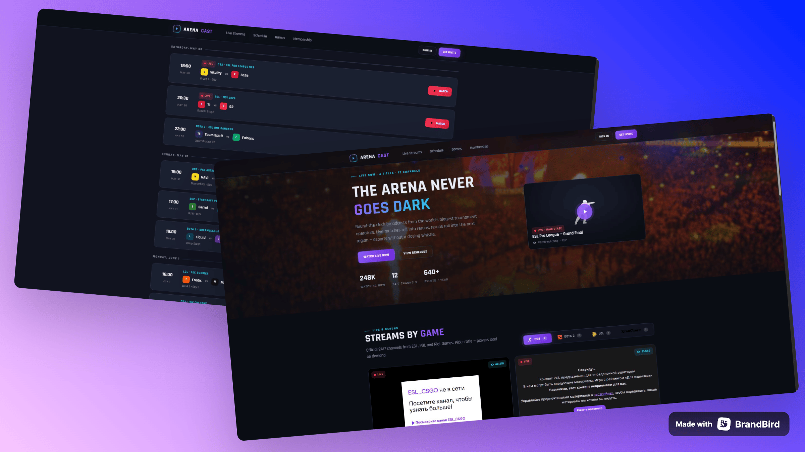

# ArenaCast — шаблон киберспортивного стрим-сайта

Лендинг круглосуточной киберспортивной трансляции: вкладки с живыми
Twitch-стримами по играм, фильтруемое расписание турниров, флоу
закрытого (invite-only) членства на всплывающих модалках и набор
внутренних страниц — about, partners, careers, contact, press и status.



## Стек

Чистые **HTML + CSS + JS** — без сборки и без зависимостей. Кладётся на
любой статический хостинг (Netlify, Vercel, nginx, GitHub Pages, S3) и
сразу работает.

## Структура

```
esports-stream-template/
├── index.html                     # главная страница
├── about / partners / careers /
│   contact / press / status.html  # внутренние страницы
└── assets/
    ├── css/style.css
    ├── js/app.js
    └── img/
```

## Запуск

Откройте `index.html` в браузере или отдайте папку любым статическим
сервером:

```bash
npx serve .
```

## Заметки

- Фон героя при каждой загрузке меняется на случайное киберспортивное фото
  (лицензия Pexels — бесплатно, без указания авторства).
- Логотип StarCraft подгружается с Wikimedia; все остальные ассеты лежат
  локально.
- К подключениям CSS/JS применён статический кэш-бастинг через `?v=`.
