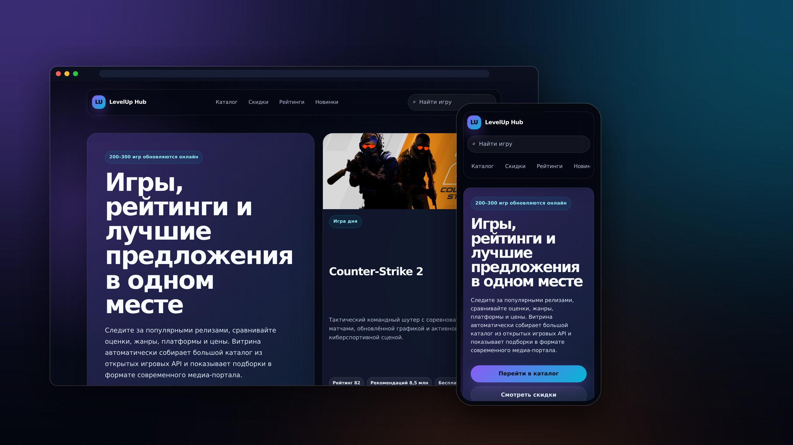

# LevelUp Hub — игровой портал (каталог · рейтинги · скидки)

Витрина-медиапортал по играм: тёмная неоновая тема с градиентными акцентами,
большой каталог на 200–300 игр, блоки скидок, трендов и редакционных подборок.
Данные подгружаются прямо в браузере из открытых API **без ключей** — бэкенд
не нужен, шаблон разворачивается как обычная статика (GitHub Pages, Netlify,
любой хостинг).



## Что внутри

| Раздел | Источник | Ключ | CORS |
|---|---|---|---|
| Каталог (200–300 игр) | [SteamSpy](https://steamspy.com/api.php) — рейтинги top100in2weeks / top100forever / top100owned | не нужен | открыт |
| Детали первых позиций | [Steam Store](https://store.steampowered.com/api/appdetails) — обложка, жанры, цена, Metacritic | не нужен | может блокироваться, есть фолбэк |
| Скидки и цены | [CheapShark](https://apidocs.cheapshark.com/) — предложения Steam с рейтингом сделки | не нужен | открыт |
| Тренды | SteamSpy top100in2weeks — игры, набирающие аудиторию | не нужен | открыт |

Если сеть или источник недоступны, каждый блок показывает **резервные данные** —
страница никогда не остаётся пустой.

## Файлы

```
levelup-hub/
├── index.html        # вся разметка, стили и логика в одном файле
├── site-config.js    # настройка названия сайта (см. «Кастомизация»)
└── README.md
```

## Как работает

* Каталог собирается из трёх рейтингов SteamSpy, дубли отбрасываются,
  первые позиции дополняются деталями Steam Store (слияние по `appid`).
* Фильтры по жанрам и сортировка (рейтинг / популярность / название)
  генерируются из загруженных данных; поиск ищет по названию, описанию,
  разработчику и жанрам.
* «Игра дня», статистика (кол-во игр, жанров, лучший рейтинг) и рейтинг
  жанров считаются на клиенте после загрузки.
* Сетки каталога, скидок и подборок адаптивные: 4 → 3 → 2 → 1 колонка,
  блок подборок использует `auto-fit`, поэтому пустых ячеек не остаётся
  ни на одном разрешении.

## Кастомизация

**Название сайта** вынесено в отдельный файл `site-config.js`:

```js
window.SITE_CONFIG = {
  name: "LevelUp Hub",                 // название сайта
  tagline: "игры, рейтинги и скидки",  // подзаголовок для <title>
  mark: ""                             // значок; пусто = инициалы названия
};
```

Поменяйте `name` — и название автоматически подставится везде: в `<title>`
вкладки, в логотип шапки (квадрат-значок собирается из инициалов:
«LevelUp Hub» → «LH»), в подвал и в заглушки обложек. Элементы помечены
атрибутами `data-site-name` / `data-site-mark`, править `index.html`
вручную не нужно. Палитра и радиусы задаются CSS-переменными в начале
`index.html` (`:root { ... }`).

**Создание уникальных копий темы.** В корне репозитория лежит скрипт
[`uniquify-theme.sh`](../uniquify-theme.sh) — он делает из одной темы
несколько визуально идентичных, но технически уникальных копий:
консистентно переименовывает кастомные CSS-классы/id и переменные, меняет
data-маркеры, сигнатуры и хеши файлов, не трогая вёрстку и контент:

```bash
# обработать html/css/js в текущей папке, собрать output.zip
./uniquify-theme.sh

# явно указать исходную папку
../uniquify-theme.sh -s levelup-hub -o levelup-copy
```

## Лицензия / данные

Шаблон — для свободного использования. Данные принадлежат соответствующим
сервисам (Steam, SteamSpy, CheapShark); соблюдайте их условия использования
при публикации.
