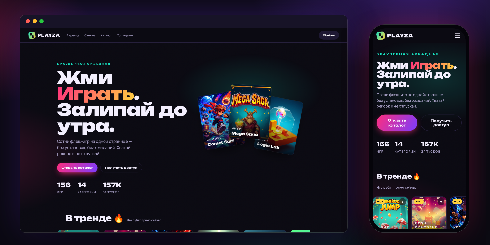
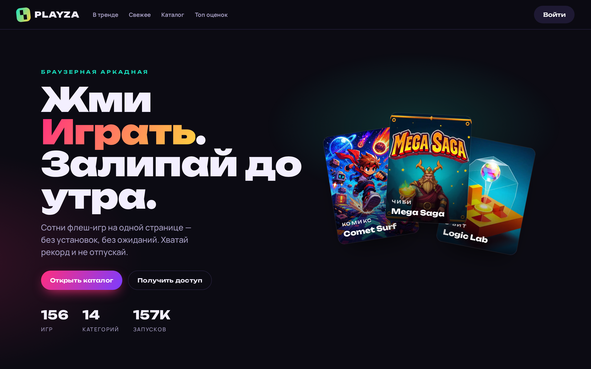

# PLAYZA — шаблон каталога браузерных флеш-игр

Одностраничный каталог игр в неоново-аркадной стилистике: хиро с
интерактивной «колодой» обложек, ленты «В тренде» / «Свежее» / «Топ по
оценкам», полный каталог с живым поиском, фильтрами по жанрам и стилевым
тегам, сортировкой и клиентской пагинацией. Запуск игр закрыт инвайтами —
кнопки «Играть» ведут на модалку invite-only входа.





## Стек

Чистые **HTML + CSS + JS** — без сборки и без зависимостей. Единственный
внешний ресурс — шрифты Google Fonts (Unbounded + Manrope).

## Структура

```
playza-game-catalog/
├── index.html              # разметка: топбар, хиро, ленты, каталог, модалки
├── site-config.js          # настройка названия сайта (см. «Кастомизация»)
├── robots.txt              # полный запрет индексации (конвенция репозитория)
├── assets/
│   ├── css/style.css       # тема: тёмный фон, неоновые акценты, грейн
│   └── js/
│       ├── app.js          # рендер карточек, фильтры, поиск, модалки, избранное
│       └── catalog.js      # данные: 156 игр, 14 жанров, стилевые теги, отзывы
└── images/games/*.webp     # обложки игр
```

## Что внутри

* **Каталог на локальных данных** — 156 игр в `catalog.js` (жанр, теги,
  рейтинг, счётчик запусков, отзывы), никаких API и бэкенда.
* **Поиск с дебаунсом**, чипы-фильтры по жанру и стилю, сортировка
  (популярность / оценка / А–Я / новизна), кнопка «Показать ещё».
* **Избранное** — сердечко на карточке, хранится в `localStorage`.
* **Модалка игры** — обложка, описание, теги, отзывы игроков; вход — только
  по инвайт-коду (форма-заглушка, регистрация «закрыта»).
* **Анимированные счётчики** в хиро (игры / категории / запуски) считаются
  из данных каталога.

## Кастомизация

**Название сайта** вынесено в отдельный файл `site-config.js`:

```js
window.SITE_CONFIG = {
  name: "PLAYZA",                   // название сайта
  tagline: "флеш-игры в браузере",  // подзаголовок для <title>
  mark: "▚"                         // значок логотипа; пусто = первая буква названия
};
```

Поменяйте `name` — и название автоматически подставится везде: в `<title>`
вкладки, в логотип шапки и в подвал. Элементы помечены атрибутами
`data-site-name` / `data-site-mark`, править `index.html` вручную не нужно.
Палитра задаётся CSS-переменными в начале `assets/css/style.css`
(`:root { ... }`).

**Создание уникальных копий темы.** В корне репозитория лежит скрипт
[`uniquify-theme.sh`](../uniquify-theme.sh) — он делает из одной темы
несколько визуально идентичных, но технически уникальных копий:
консистентно переименовывает кастомные CSS-классы/id и переменные, меняет
data-маркеры, сигнатуры и хеши файлов, не трогая вёрстку и контент:

```bash
# обработать html/css/js в текущей папке, собрать output.zip
./uniquify-theme.sh

# явно указать исходную папку
../uniquify-theme.sh -s playza-game-catalog -o playza-copy
```

## Заметки

- Если файл обложки отсутствует, карточка автоматически рисует градиентную
  заглушку в цветах жанра с тегом и названием игры — каталог не ломается.
- Текстовая плашка (тег + название) лежит поверх любой обложки на тёмном
  сглаживающем градиенте.
- Скроллбары (вертикальный и в лентах) стилизованы под тему; при открытии
  модалок страница не дёргается — ширина скроллбара компенсируется.
- Адаптивность от 320px: бургер-меню, горизонтальные чипы-фильтры,
  двухколоночная сетка на мобильных.
