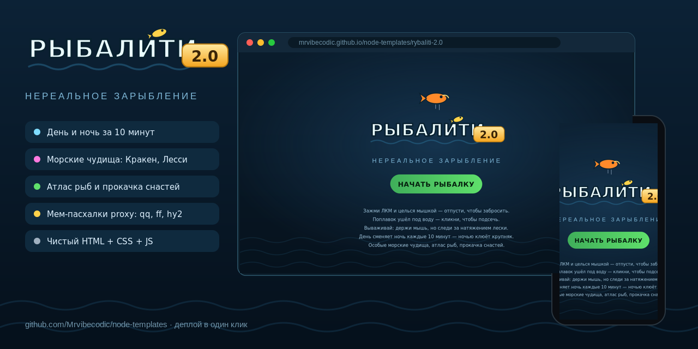
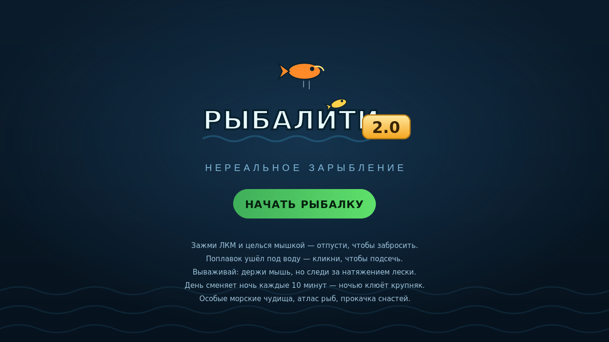
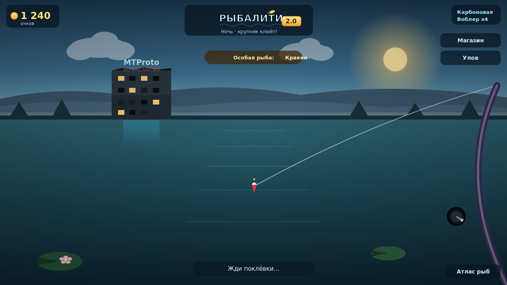
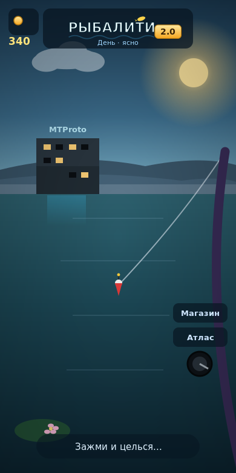

# rybaliti-2.0

**Рыбалити 2.0 — Нереальное зарыбление.** Браузерная игра-рыбалка от первого
лица на чистом **HTML + CSS + JS**, без сборки и без зависимостей. Кладётся на
любой статический хостинг (GitHub Pages, Netlify, Vercel, nginx, S3) и сразу
работает — достаточно открыть `index.html`.



## Скриншоты

| Главная | В игре | Мобильный |
| --- | --- | --- |
|  |  |  |

## Как играть

- Зажми **ЛКМ** и целься мышкой — отпусти, чтобы забросить (полоска задаёт дальность).
- Жди поклёвки. Когда поплавок резко уйдёт под воду — **кликни**, чтобы подсечь.
- Вываживай: **держи мышь**, чтобы тянуть, но следи за натяжением лески — порвёшь, рыба сорвётся.
- За рыбу дают очки. Трать их в магазине на удочки (шанс, прочность, подсечка) и приманки (крупнее и реже рыба).

## Фишки

- Вид от первого лица, вся графика рисуется кодом на `<canvas>` — **ассетов-картинок в игре нет**.
- Цикл дня и ночи за 10 минут: солнце и луна идут по дуге, звёзды, облака, рассвет и закат. **Ночью клюёт крупная и редкая рыба.**
- 16 видов рыбы с уникальными процедурными превью плюс особые морские чудища (Кракен, Лесси, Посейдон, Левиафан).
- Раз в день — особое событие: шанс на чудище, которое удержит только крепкая снасть (карбон и выше).
- Экономика со смыслом: заряды у приманок, износ удочек от натяжения, ремонт и прокачка. Бамбук и червяк — вечные.
- Атлас рыб со всеми видами, очками и отметкой пойманных; журнал улова с рекордом.
- Мем-пасхалки proxy-комьюнити: рыбы бормочут фингерпринты (`qq`, `ff`, `hy2`, `pq`, `naiveproxy`…), за рекой мигает разбитый отель `MTProto · NO VACANCIES`, по дневным часам из воды выглядывает ехидная мартышка.
- Прогресс и очки сохраняются в `localStorage`.

## Структура

```
rybaliti-2.0/
  index.html          разметка и подключение ресурсов
  css/styles.css      стили интерфейса
  js/data.js          данные: рыбы, удочки, приманки, реплики, палитры
  js/render.js        вся отрисовка на canvas (сцена, рыбы, отель, мартышка)
  js/game.js          состояние, игровой цикл, ввод, магазин, атлас, журнал
  assets/logo.svg     логотип «Рыбалити 2.0»
  assets/sprites/     PNG-спрайты рыб, чудищ и снастей (опционально, есть фолбэк)
  screenshots/        скриншоты для README (home / desktop / mobile + svg-исходники)
  previews/           og-image.png для превью ссылок и плакат-исходник
  robots.txt          запрет индексации
```

## Спрайты (опционально)

Превью рыб и чудищ, иконки снастей в магазине, поплавок, кувшинки, камыш и
мартышка автоматически подхватываются из `assets/sprites/<имя>.png`, если файл
есть; иначе рисуются процедурно на canvas. Имена — латиницей: рыбы (`okun`,
`schuka`, `som`…), чудища (`kraken`, `lessi`, `poseidon`, `leviafan`), удочки
(`bamboo`, `glass`, `carbon`, `spin`, `epic`), приманки (`worm`, `maggot`,
`wobbler`, `spinner`, `livebait`), плюс `bobber`, `lilypad`, `reeds`, `monkey`.
Картинки генерируются нейросетью (FLUX через Cloudflare Workers AI), фон
вырезается `rembg` — см. отдельный `IMAGES_TO_GENERATE.md` с промптами.

## Запуск и деплой

Сборка не нужна. Локально — просто открыть `index.html` в браузере. Для
хостинга залить папку целиком на любой статический сервис; на GitHub Pages
достаточно положить содержимое в ветку/папку Pages.

## robots.txt

Лежит в корне шаблона и полностью запрещает индексацию всеми поисковиками и
краулерами (включая AI-ботов). Работает только из корня домена, куда задеплоен
сайт (`https://site.com/robots.txt`).

## Превью ссылок (OG-картинка)

Баннер `previews/og-image.png` (1280×640) — для красивых превью ссылок в
Telegram/соцсетях. Чтобы github.com-ссылка на репозиторий подтягивала его,
загрузите файл в **Settings → General → Social preview**.

## Уникализация (`uniquify-theme.sh`)

Шаблон совместим со скриптом из корня репозитория, но часть классов игра
строит динамически через `innerHTML`, а их имена скрипт в JS-шаблонах не
переписывает. Чтобы уникализация не рассинхронила стили с разметкой, запускайте
скрипт, исключив эти классы из переименования:

```
./uniquify-theme.sh --exclude "emoji,info,nm,ds,st,acts,buy,can,no,equip,equipped,fix,anm,ainfo,spbadge,sp,seen,empty"
```

Остальные классы, id и `<meta name="generator">` уникализируются как обычно;
DOM, логика и текст не меняются.

## Благодарности

Вдохновлено коллекцией статических шаблонов [node-templates](https://github.com/Mrvibecodic/node-templates).
