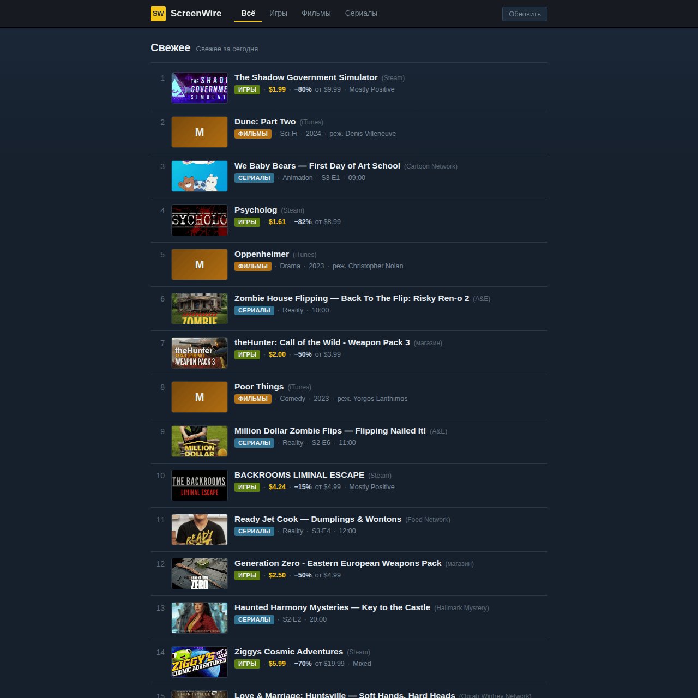

# ScreenWire — дайджест ссылок (игры · фильмы · сериалы)

Лёгкий агрегатор ссылок в духе Hacker News: плотная лента с миниатюрами релизов,
данные подгружаются прямо в браузере из открытых API **без ключей**.

Дизайн — гибрид Steam (тёмная slate-палитра, голубые ссылки) и IMDb (золотой акцент,
вкладки с подчёркиванием). Никаких градиентных «блобов» и свечения.



## Что внутри

| Раздел | Источник | Ключ | CORS |
|---|---|---|---|
| Игры | [CheapShark](https://apidocs.cheapshark.com/) — свежие скидки и релизы в Steam/GOG/Epic и др. | не нужен | открыт |
| Фильмы | [IMDb API](https://api.imdbapi.dev/) — популярные фильмы текущего года (постеры, рейтинг, жанр) | не нужен | открыт |
| Сериалы | [TVMaze](https://www.tvmaze.com/api) — эпизоды в эфире сегодня | не нужен | открыт |

Все три API отдают данные напрямую в браузер, поэтому бэкенд не требуется —
шаблон разворачивается как обычная статика (GitHub Pages, Netlify, любой хостинг).

## Файлы

```
screenwire-digest/
├── index.html              # разметка: верхняя панель, вкладки, лента
├── robots.txt              # закрыт от всех краулеров
├── assets/
│   ├── css/style.css       # стиль Steam × IMDb
│   ├── js/app.js           # загрузка фидов, рендер, вкладки, фолбэк
│   └── img/favicon.svg
└── README.md
```

## Как работает

* `app.js` тянет каждый раздел один раз и кеширует в памяти.
* Вкладки **Всё / Игры / Фильмы / Сериалы** переключают ленту; «Всё» — чередование разделов.
* Кнопка **Обновить** сбрасывает кеш и тянет данные заново.
* Кнопка **Показать ещё** подгружает следующие 15 строк (клиентская пагинация).
* Если сеть/источник недоступны — раздел показывает **резервные данные**, лента не пустует.
  Подзаголовок при этом показывает «офлайн».

## Как поменять источники

Логика загрузки — в `loadKind()` (файл `assets/js/app.js`). Чтобы добавить или
заменить источник, нужны две вещи:

1. URL API (keyless + открытый CORS) в `loadKind()`.
2. Функция-нормализатор (`mapGames` / `mapMovies` / `mapSeries`), приводящая ответ
   к общему виду: `{ kind, title, url, source, meta: [строки] }`.

### Другие keyless-API на замену или дополнение

* **Игры:** FreeToGame (бесплатные игры), RAWG (нужен бесплатный ключ — тогда не keyless).
* **Кино/ТВ:** TMDB (нужен бесплатный ключ), iTunes Search API (`itunes.apple.com/search`) — keyless, есть CORS.
  Примечание: прежний источник Apple Marketing RSS перестал отдавать данные, поэтому фильмы переведены на IMDb API.
* **Новости (RSS):** ленты IGN / Polygon / Variety через прокси RSS→JSON
  (например `api.rss2json.com`) — для настоящих новостных ссылок.

## Кастомизация

**Название сайта** вынесено в одну переменную в начале `assets/js/app.js`:

```js
var SITE_TITLE = "ScreenWire";
```

Поменяйте её — и название автоматически подставится в шапку (текст и квадрат-логотип
из инициалов: «ScreenWire» → «SW») и в `<title>` вкладки. Больше править название
вручную в `index.html` не нужно. Палитра и акценты задаются CSS-переменными в начале
`assets/css/style.css` (`:root { ... }`).

**Создание уникальных копий темы.** В корне репозитория лежит скрипт
[`uniquify-theme.sh`](../uniquify-theme.sh) — он делает из одной темы несколько
визуально идентичных, но технически уникальных копий: переименовывает кастомные
CSS-классы/id и переменные (консистентно во всех файлах), меняет data-маркеры,
сигнатуры и хеши файлов. DOM, вёрстка и текстовый контент при этом не трогаются.
Положите скрипт в папку шаблона и запустите, либо укажите папку явно:

```bash
# простой режим — обработать html/css/js в текущей папке, собрать output.zip
./uniquify-theme.sh

# явно указать исходную папку
../uniquify-theme.sh -s screenwire-digest -o screenwire-copy
```

## Кеш-бастинг

При изменении CSS/JS поднимите параметр версии в подключениях:
`style.css?v=<unix>` и `app.js?v=<unix>` в `index.html`.

## Лицензия / данные

Шаблон — для свободного использования. Данные принадлежат соответствующим сервисам
(CheapShark, IMDb, TVMaze); соблюдайте их условия использования при публикации.
## Связь

Вопросы, идеи и предложения — в Telegram-чате:
[t.me/+O5jAhwcYdYhlY2Yy](https://t.me/+O5jAhwcYdYhlY2Yy).
