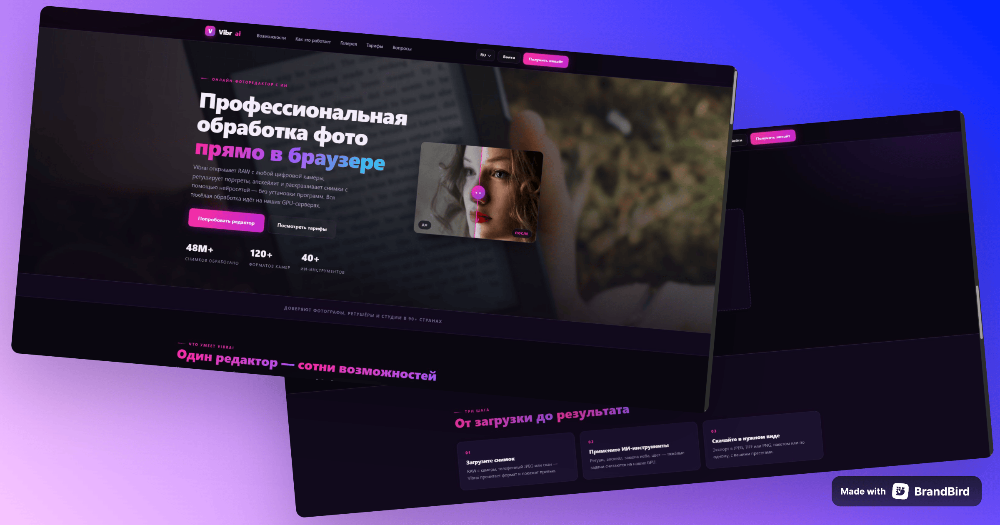

# Vibrai — шаблон сайта онлайн-фоторедактора

Лендинг онлайн-фоторедактора по подписке: вздымающиеся плитки инструментов,
которые раскрываются при наведении, перетаскиваемый слайдер «до/после»,
карусель-галерея и демо-загрузчик RAW. Интерфейс на трёх языках (RU / EN / DE),
регистрация по инвайтам и обратная связь — целиком через модальные окна. Плюс
внутренние страницы: возможности, тарифы, о сервисе, контакты и статус.



Чистый **HTML + CSS + JS** — без сборки, без зависимостей, **ноль внешних
запросов** (системные шрифты, локальный фавикон, все изображения локальные).

## Структура

```
vibrai-photo-editor/
├── index.html                       # главная
├── features / pricing / about /
│   contact / status.html            # внутренние страницы
├── robots.txt                       # блокировка всех краулеров
└── assets/
    ├── css/style.css
    ├── js/app.js                    # словарь I18N + вся логика
    └── img/
```

## Особенности

- Три языка **RU / EN / DE** из одного словаря `I18N` в `app.js` (атрибуты
  `data-i18n`). Язык определяетс
## Связь

Вопросы, идеи и предложения — в Telegram-чате:
[t.me/+O5jAhwcYdYhlY2Yy](https://t.me/+O5jAhwcYdYhlY2Yy).
