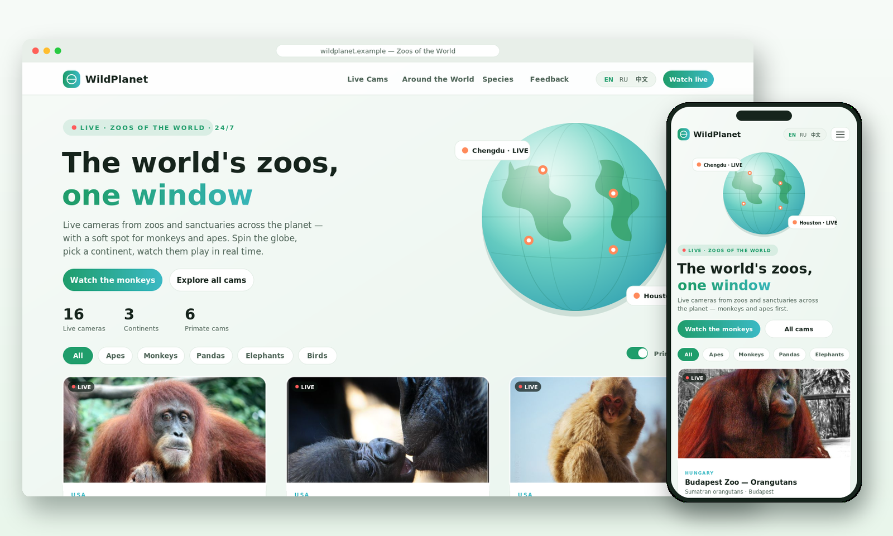

# WildPlanet — шаблон сайта «Зоопарки мира»

Витрина живых трансляций из зоопарков и заповедников по всему миру — с
упором на обезьян и человекообразных. Анимированный глобус в хиро, сетка
камер с ленивой загрузкой плееров, фильтры по видам животных и тумблер
«только приматы», блок-карта по континентам, секция видов и форма
обратной связи с клиентской валидацией. Интерфейс на трёх языках —
EN / RU / 中文, светлая тема, адаптив от 320 px.



## Стек

Чистые **HTML + CSS + JS** — без сборки и без зависимостей. Единственный
внешний ресурс — шрифт Google Fonts (Plus Jakarta Sans). Кладётся на
любой статический хостинг (Netlify, Vercel, nginx, GitHub Pages, S3) и
сразу работает.

## Структура

```
worldzoo-stream-template/
├── index.html              # вся страница
├── robots.txt              # полный запрет индексации (конвенция репозитория)
└── assets/
    ├── css/style.css       # светлая тема, анимации, адаптив
    ├── js/
    │   ├── i18n.js         # переводы EN / RU / ZH
    │   ├── data.js         # список зоопарков и трансляций
    │   └── app.js          # рендер, фильтры, i18n, форма, конфиг бренда
    └── img/                # локальные фото животных, favicon, og-image
```

## Запуск

Откройте папку любым статическим сервером:

```bash
npx serve .
```

Twitch-плееры требуют параметр `parent` с доменом — шаблон подставляет
`location.hostname` сам, поэтому работает и на `localhost`, и на боевом
домене. Открывать страницу нужно по http(s), а не как `file://`.

## Что внутри

* **16 живых камер** с официальных плееров зоопарков: Camzone
  (Сан-Диего), CamStreamer (Детройт, Будапешт), IPCamLive (Мэриленд),
  HDOnTap (Рид-Парк), Ant Media (Хьюстон), El Paso Zoo HLS, iPanda/CCTV
  (Чэнду) и Twitch. Приоритет — обезьяны: шесть камер с приматами,
  карточки приматов всегда первые в сетке.
* **Ленивая загрузка** — iframe плеера создаётся только по клику на
  карточку, до этого показывается локальное фото с бейджем эфира.
* **Фильтры** по группам животных, тумблер «только приматы», блок-карта
  по континентам со счётчиками камер.
* **Три языка** (EN / RU / 中文) — все строки в `i18n.js`, выбор
  сохраняется в `localStorage`, при первом входе берётся язык браузера.
* **Форма обратной связи** — клиентская валидация имени, e-mail и длины
  сообщения, подтверждение «Отправлено»; бэкенда нет, свой обработчик
  подключается в `hookForm()` (`assets/js/app.js`).
* **Адаптив** — брейкпоинты 900 и 560 px, сетка камер
  `minmax(min(310px,100%),1fr)` не переполняется даже на 320 px,
  анимации уважают `prefers-reduced-motion`.

## Кастомизация

**Название сайта** — один объект в начале `assets/js/app.js`; имя
автоматически попадает в шапку, подвал, `<title>` и OG-теги (атрибут
`data-brand`):

```js
const SITE_CONFIG = {
  name: "WildPlanet",
  tagline: { en: "Zoos of the World", ru: "Зоопарки мира", zh: "世界动物园" },
  defaultLang: "en"
};
```

**Камеры** — массив `window.ZOO_CAMS` в `assets/js/data.js`:

```js
{
  id: "houston-gorilla",
  name: { en: "...", ru: "...", zh: "..." },
  region: "americas",
  group: "apes",
  primate: true,
  embed: "https://...",
  type: "iframe",
  image: "assets/img/houston-gorilla.jpg",
  live247: false
}
```

`region` — континент для блок-карты, `group` — фильтр-чип, `embed` —
src iframe-плеера. Для Twitch-камер ставьте `type: "twitch"` и
плейсхолдер `PARENT_HOST` в `embed` — он заменится на текущий домен.

**Создание уникальных копий темы.** В корне репозитория лежит скрипт
[`uniquify-theme.sh`](../uniquify-theme.sh) — он делает из одной темы
несколько визуально идентичных, но технически уникальных копий:
консистентно переименовывает кастомные CSS-классы/id и переменные,
меняет data-маркеры, сигнатуры и хеши файлов, не трогая вёрстку и
контент:

```bash
./uniquify-theme.sh

../uniquify-theme.sh -s worldzoo-stream-template -o worldzoo-copy
```

## Заметки

- Все трансляции встроены из официальных открытых источников и
  принадлежат соответствующим зоопаркам; камеры с пометкой «дневные»
  активны в светлое время по местному времени зоопарка.
- Фото животных скачаны локально (Openverse, свободные лицензии) —
  внешних картинок шаблон не тянет.
- OG-превью ссылок: `assets/img/og-image.png` (десктоп 1280×640, копия —
  `previews/worldzoo-stream-template-desktop.png`); для боевого домена
  замените `og:image` в `index.html` на абсолютный URL.
- К подключениям CSS/JS применён статический кэш-бастинг через `?v=`.
